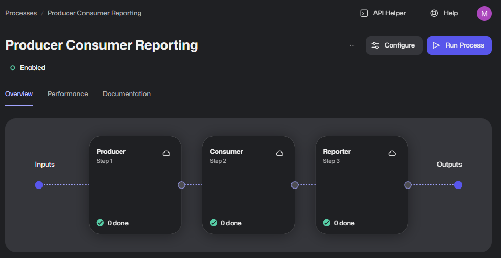

# Template: Python - Producer-Consumer-Reporter

This template leverages the new [Python framework](https://github.com/robocorp/robocorp), the [libraries](https://github.com/robocorp/robocorp/blob/master/docs/README.md#python-libraries) from to same project as well.

This template contains a working robot implementation that has the basic structure where the first part produces work items from an input, the second one consumes those newly created output work items and the third one reports results of the second step.



The template tries to keep the amount of functional code at a minimum so you have less to clear out and replace with your own implementation, but some functional logic is needed to have the template working and guiding the key parts.

> We recommended checking out the article "[Using work items](https://robocorp.com/docs-robot-framework/development-guide/control-room/work-items)" before diving in.

## Tasks

The robot is split into three tasks, meant to run as separate steps in Control Room. The first task generates (produces) data, the second one reads (consumes) and processes that data, and the third one creates a report of the results.

### The first task (the producer)

- Load the example Excel file from work item
- Split the Excel file into work items for the consumer, where each work item contains:
  - Name
  - Zip code
  - Product information
- One extra work item is created which will guarantee that Reporter step is triggered even if all Consumer work items fail.

The payload of "Reporter" work item, which identifies this work item as extra work item for Consumer and Reporter.

```json
{ "TYPE": "Reporter" }
```

### The second task (the consumer)

> We recommended checking out the article "[Work item exception handling](https://robocorp.com/docs-robot-framework/development-guide/control-room/work-items#work-item-exception-handling)" before diving in.

- Pass (create output work item and mark this item as done) the "Reporter" work item to Reporter step to guarantee that reporting will be done even if all consumer work items fail
- Loop through all work items in the queue and access the payloads from the previous step
- Validate the ZIP code (must be between 1000-9999)
- Process each order with the provided information
- Handle potential errors:
  - Invalid ZIP codes (BUSINESS error)
  - Missing fields (APPLICATION error)

### The third task (the reporter)

- Collects and analyzes the results from the consumer step
- Uses the Robocorp Process API to fetch detailed information about the consumer step's work items
- Generates a report showing:
  - Success/failure status for each order
  - Order details (Name, ZIP code, Product)
  - Any exceptions that occurred during processing

### Step configuration in the Control Room for last step (the reporter)

This example is based on the reporter step configuration that will trigger last step only after
all consumer step executions have completed and resulted in either done or fail.


## Local testing

For best experience to test the work items in this example we recommend using [Sema4.ai SDK extension for VS Code](https://robocorp.com/docs/visual-studio-code/extension-features). With the Sema4 extension you can simply run and [select the input work items](https://robocorp.com/docs/visual-studio-code/extension-features#using-work-items) to use, create inputs to simulate error cases, and so on.

There are three example input Excel files in [./devdata/work-items-in/test-input-for-producer](./devdata/work-items-in/test-input-for-producer) folder

1. [orders.xlsx](./devdata/work-items-in/test-input-for-producer/orders.xlsx) containing 9 valid orders
2. [orders_fails.xlsx](./devdata/work-items-in/test-input-for-producer/orders_fails.xlsx) containing 7 valid orders and 2 faulty orders
3. [orders_all_fail.xlsx](./devdata/work-items-in/test-input-for-producer/orders_all_fail.xlsx) containing 2 faulty orders

## Extending the template

> The [producer-consumer](https://en.wikipedia.org/wiki/Producer%E2%80%93consumer_problem) model is not limited to two steps, it can continue so that the consumer generates further work items for the next step and so on.

This template already includes a reporter step that demonstrates how to extend the basic producer-consumer pattern. The reporter shows how to:

1. Access the Robocorp Process API to get detailed information about previous steps
2. Collect and analyze results from multiple work items
3. Generate meaningful reports about the process execution

You can further extend this pattern by:

- Adding more validation steps
- Implementing different types of reporting
- Adding more sophisticated error handling
- Creating additional processing steps

---

🚀 Now, go get'em

Start writing Python and remember that the AI/LLM's out there are getting really good and creating Python code specifically.

For more information, do not forget to check out the following:

- [Robocorp Documentation -site](https://robocorp.com/docs)
- [Portal for more examples](https://robocorp.com/portal)
- [Robocorp API](https://robocorp.com/api)
- Follow our main [robocorp -repository](https://github.com/robocorp/robocorp) as it is the main location where we developed the libraries and the framework.
